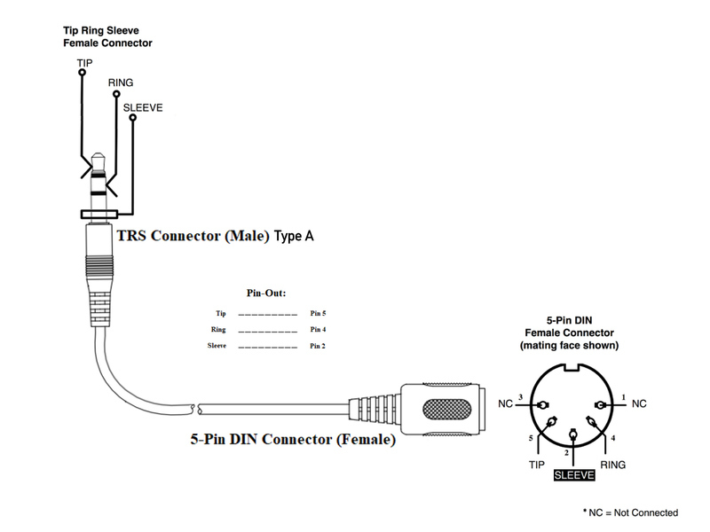

# eTextile-Synthetizer
### Exploring music through textile

- Author: Maurin Donneaud <maurin@etextile.org>
- Repository: https://github.com/eTextile/Synth/tree/master/
- Project web page: https://synth.eTextile.org
- License: CC-BY-SA (see the License file)


#### HARDWARE_ELECTRONIC
##### Features
- Teensy 4.0 (600MHz MCU)
- eTextile-Synthetizer PCB made with **KiCad** (V5.0.2)
- Daisy chainable design using **3.5 stereo mini Jack**
    - **LINE-OUT** : High quality 16 bit DAC OUTPUT (Headphones)
    - **SIG-IN** : Audio stereo input sampling rate 44.1 kHz
    - **SIG-OUT** : High quality 16 bit DAC OUTPUT (Line)
    - **MIDI-IN** : MIDI INPUT using mini jack 
    - **MIDI-OUT** : MIDI OUTPUT using mini jack

- **BUILT_IN SWITCHES**
    - **Button D1 (DOT)** Short press : CALIBRATE THE SENSOR MATRIX
    - **Button D1 (DOT)** Long press : SAVE ALL PARAMETERS TO THE EEPROM MEMORY
    - **Button D2 (STAR)** Short press : SELECT MODE (see below)
    - **Button D2 (STAR)** Long press : MIDI LEARN MODE

- **SELECT MODE**

|      MODE     |       LEDs      |                     FONCTION                    |
| :------------ | :-------------  | :---------------------------------------------- |
| **LINE_OUT**  | D1-OFF / D2-OFF | line_out level adjustment using rotary encoder  |
| **SIG_IN**    | D1-ON  / D2-OFF | sig_in level adjustment using rotary encoder    |
| **SIG_OUT**   | D1-OFF / D2-ON  | sig_out level adjustment using rotary encoder   |
| **THRESHOLD** | D1-ON  / D2-ON  | threshold value adjustment using rotary encoder |

- **MIDI LEARN MODE**
This MODE is setting the whole sensor in auto-mapp state.
As experienced it is not possible to use software auto-mapping functionalities if a controller is sending more than one value at a time. In the MIDI LEARN mode we use the encoder button to select the blob value (STATE, CX, CY, WIDTH, HEIGHT, DEPTH) that you want to send to your computer. After the desired values have been mapped a short press on the STAR or DOT button will exit the MIDI LEARN MODE and you will be able to play your custom presets.

- **MINI-JACK MIDI PLUG**


##### KICAD (Prerequisite)
- Installing KiCad : https://kicad-pcb.org/
- Installing Github Libraries : https://github.com/KiCad/
```
    mkdir KiCad_Libraries
    cd KiCad_Libraries
    git clone https://github.com/KiCad/kicad-symbols
    git clone https://github.com/KiCad/kicad-footprints
    git clone https://github.com/KiCad/kicad-packages3D
```
- Configuring KiCad Libraries
```
    KiCad > Préférences > Configure path
    KICAD_SYMBOL_DIR : (add your own path)/KiCad_Libraries/kicad-symbols
    KICAD_TEMPLATE_DIR : DO NOT CHANGE
    KICAD_USER_TEMPLATE_DIR : DO NOT CHANGE
    KIGITHUB : DO NOT CHANGEMIDI-wiring-diagram.jpg
    KISYS3DMOD : (add your own path)/KiCad_Libraries/kicad-packages3D
    KISYSMOD : (add your own path)/KiCad_Libraries/kicad-footprints
```
##### PCB specifications
- **Base Material** : FR-4 TG130
- **No. of Layers** : 2 layers
- **PCB Dimensions** : 70mm / 76mm
- **No. of Different Designs** : 1
- **PCB Thickness** : 1.20 mm
- **PCB Color** : Matte Black
- **Surface Finish** : ENIG
- **Minimum Solder Mask Dam** : 0.4mm
- **Copper Weight** : 1oz.
- **Minimum Drill Hole Size** : 0.3mm
- **Trace Width / Spacing** : 6/6 mil
- **Plated Half-holes / Castellated Holes** : No
- **Impedance Control** : No

##### Bill of materials (BOM)
```
    matrix/Hardware_electronic/kicad/e256_teensy4_0/pick_and_place/BOM_e256_teensy4_0.xls
    matrix/Hardware_electronic/kicad/e256_teensy4_0/pick_and_place/BOM_e256_teensy4_0.cvs
```

## Acknowledgements
-  Matt Venn : for his [teensy 4.0 Open-Hardware soundCard](https://github.com/mattvenn/teensy-audio-fx) made with KiCad ;-)

## TODO
- Make eTextile-Synthetizer/Dasy PCB
