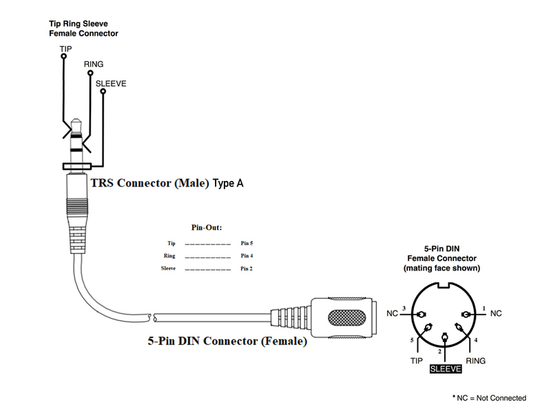

# eTextile-Synthesizer
## Exploring music through textile


### HARDWARE_ELECTRONIC

#### PCB_SCHEMATICS
Here is the last PCB schematics document : [eTextile_synth_schematics.pdf](./docs/eTextile_synth_schematics.pdf)

#### FEATURES
- Teensy 4.0 (600MHz MCU)
- eTextile-Synthesizer PCB made with **KiCad** (V5.0.*)
- Daisy chainable design using **3.5 stereo mini Jack**
    - **LINE-OUT** : High quality 16 bit DAC OUTPUT (Headphones)
    - **SIG-IN** : Audio stereo input sampling rate 44.1 kHz
    - **SIG-OUT** : High quality 16 bit DAC OUTPUT (Line)
    - **MIDI-IN** : MIDI INPUT using mini jack 
    - **MIDI-OUT** : MIDI OUTPUT using mini jack

#### BUILT_IN SWITCHES
- **Button D1 (DOT)** Short press : CALIBRATE THE SENSOR MATRIX
- **Button D1 (DOT)** Long press : SAVE CONFIG TO FLASH MEMORY (standalone mode)
- **Button D2 (STAR)** Short press : SELECT MODE (see below)
- **Button D2 (STAR)** Long press : MIDI LEARN MODE

#### SELECT MODE
    |      MODE     |       LEDs      |                     FONCTION                    |
    | :------------ | :-------------  | :---------------------------------------------- |
    | **LINE_OUT**  | D1-OFF / D2-OFF | line_out level adjustment using rotary encoder  |
    | **SIG_IN**    | D1-ON  / D2-OFF | sig_in level adjustment using rotary encoder    |
    | **SIG_OUT**   | D1-OFF / D2-ON  | sig_out level adjustment using rotary encoder   |
    | **THRESHOLD** | D1-ON  / D2-ON  | threshold value adjustment using rotary encoder |

#### MIDI LEARN
> **TODO** — not yet implemented (long press STAR is reserved for this feature).

In MIDI LEARN mode the device will send each blob parameter (X, Y, Z, width, height) one at a time so that external software can map them without ambiguity.
Use the rotary encoder to cycle through the available parameters; the currently selected parameter is the only one transmitted.
A short press on the **DOT** or **STAR** button exits MIDI LEARN mode and returns to the previous operating mode.

> **Note:** static MIDI mappings are configured via the [Mapping web app](https://etextile.github.io/Mapping/) and uploaded to the device over USB.

#### MIDI PLUG
**MIDI TRS-A (MIDI 2.0 Standard)**


#### KICAD (Prerequisite)
- Installing KiCad : https://kicad-pcb.org/
- Installing Github Libraries : https://github.com/KiCad/
```
    mkdir KiCad_Libraries
    cd KiCad_Libraries
    git clone https://github.com/KiCad/kicad-symbols
    git clone https://github.com/KiCad/kicad-footprints
    git clone https://github.com/KiCad/kicad-packages3D
```
- Configuring KiCad Libraries
```
    KiCad > Préférences > Configure path
    KICAD_SYMBOL_DIR : (add your own path)/KiCad_Libraries/kicad-symbols
    KICAD_TEMPLATE_DIR : DO NOT CHANGE
    KICAD_USER_TEMPLATE_DIR : DO NOT CHANGE
    KIGITHUB : DO NOT CHANGEMIDI-wiring-diagram.jpg
    KISYS3DMOD : (add your own path)/KiCad_Libraries/kicad-packages3D
    KISYSMOD : (add your own path)/KiCad_Libraries/kicad-footprints
```
##### PCB specifications
- **Base Material** : FR-4 TG130
- **No. of Layers** : 2 layers
- **PCB Dimensions** : 70mm / 76mm
- **No. of Different Designs** : 1
- **PCB Thickness** : 1.20 mm
- **PCB Color** : Matte Black
- **Surface Finish** : ENIG
- **Minimum Solder Mask Dam** : 0.4mm
- **Copper Weight** : 1oz.
- **Minimum Drill Hole Size** : 0.3mm
- **Trace Width / Spacing** : 6/6 mil
- **Plated Half-holes / Castellated Holes** : No
- **Impedance Control** : No

##### BOM (Bill Of Materials)
```
    matrix/Hardware_electronic/kicad/e256_teensy4_0/pick_and_place/BOM_e256_teensy4_0.xls
    matrix/Hardware_electronic/kicad/e256_teensy4_0/pick_and_place/BOM_e256_teensy4_0.cvs
```

## Acknowledgements
-  Matt Venn : for his [teensy 4.0 Open-Hardware sound_card](https://github.com/mattvenn/teensy-audio-fx) made with KiCad ;-)

## TODO
- add MIDI THRU
- Make a casing
- Make eTextile-Synthesizer/Dasy PCB

